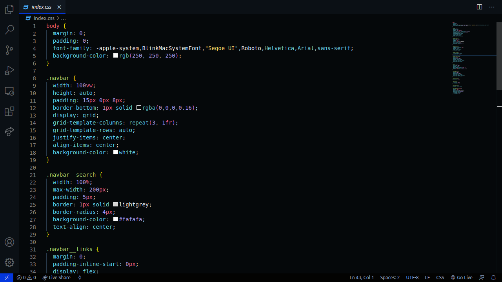
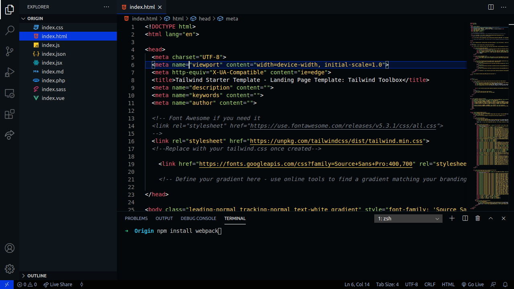
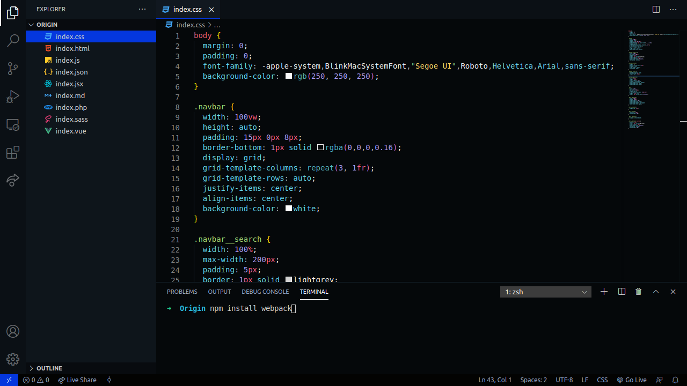
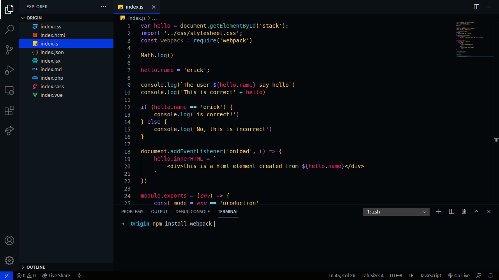
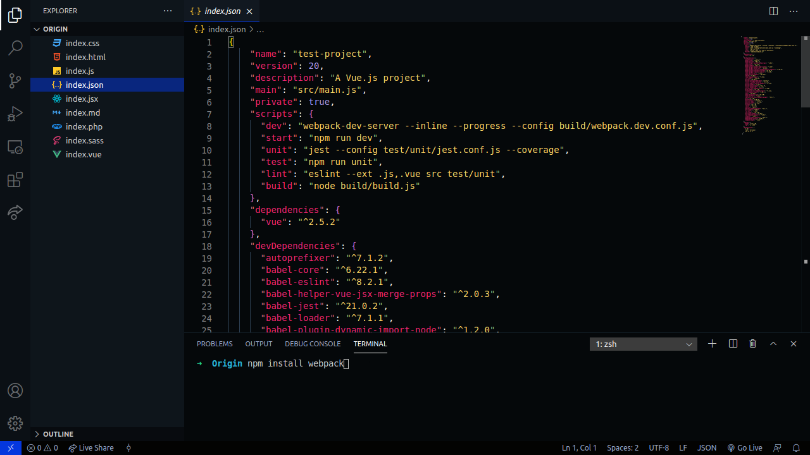

    
     
    <b style="font-size: 48px; color: #1d89ff;">Origin</b>
    
VS Code Theme

 

    

 
 
 
 

    

        <b style="font-size: 32px;">Based on the Seti UI theme from Sublime Text 3, Atom One Dark and Dobri Next Electron</b>
    

 
 
 
 

    <b style="font-size: 32px; writing-mode: tb-rl;">HTML</b>
    

 

    <b style="font-size: 32px; writing-mode: tb-rl;">CSS</b>
    

 

    <b style="font-size: 32px; writing-mode: tb-rl;">JAVASCRIPT</b>
    

 

    <b style="font-size: 32px; writing-mode: tb-rl;">JSON</b>
    

 
 
 
 

    

        <b style="font-size: 32px;">INSTALL NOW AND ENJOY :)</b>
         
        <a style="font-size: 24px;" href="https://github.com/LuisFalconMX">LuisFalconMX</a>
    

